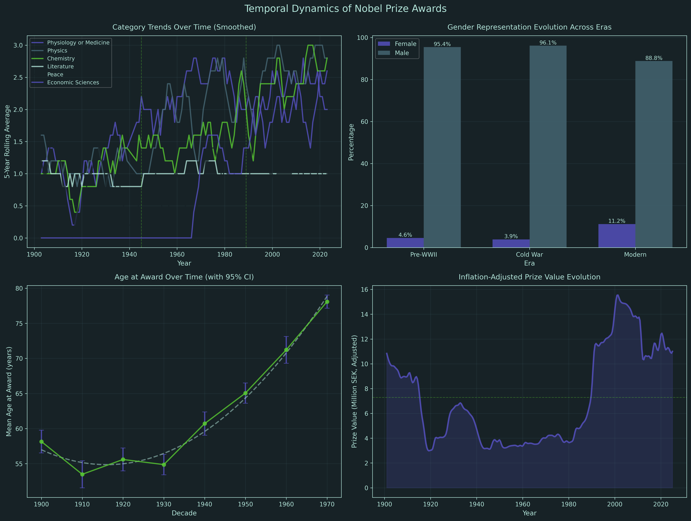
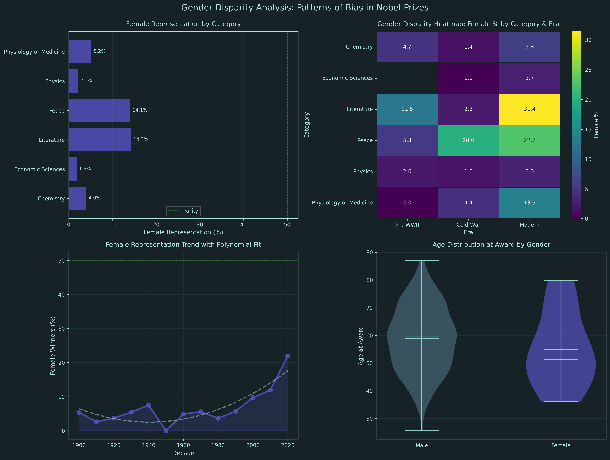
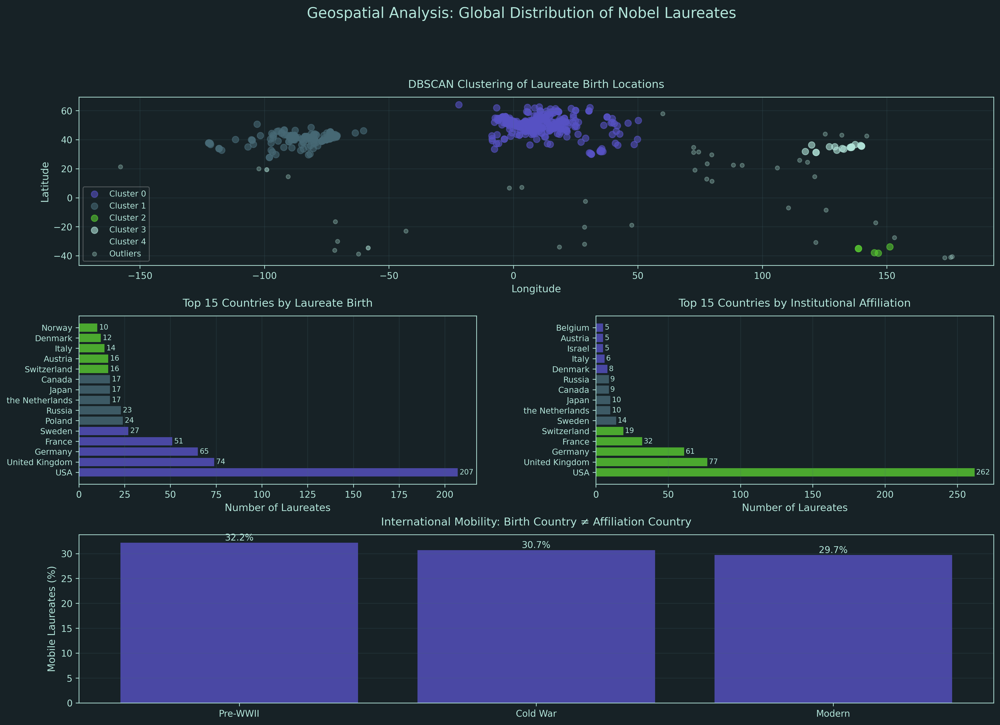
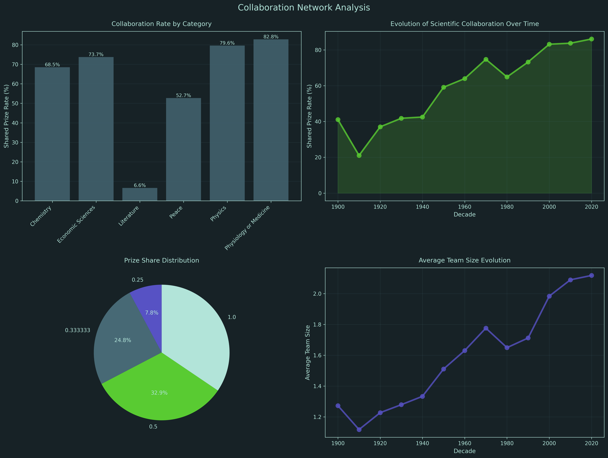
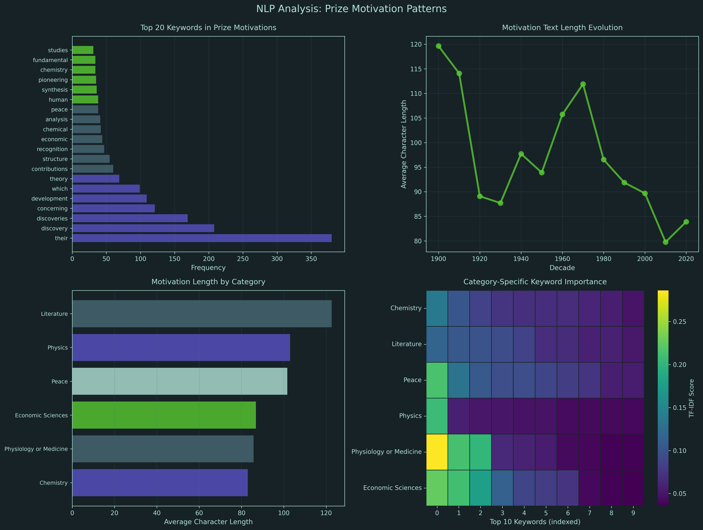
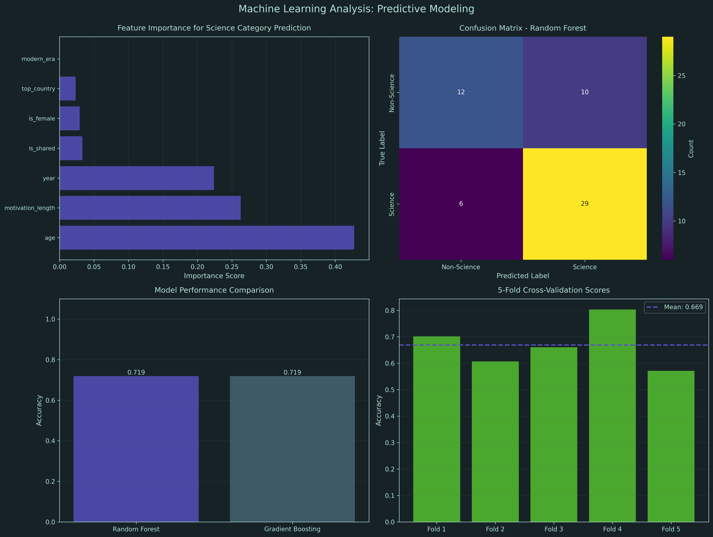
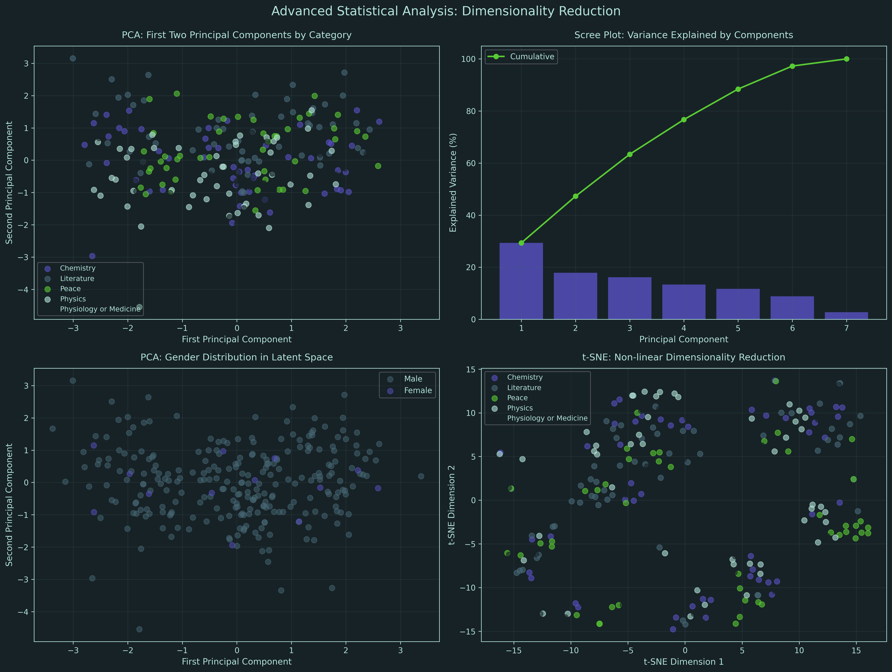
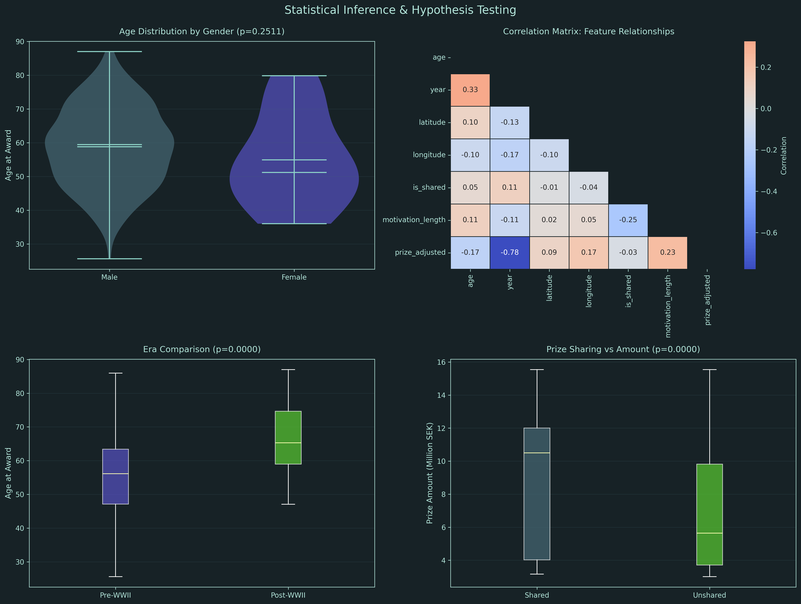

# Nobel Prize Winners Dataset Analysis (1901-2025)


**Comprehensive Multi-Dimensional Data Science Analysis**

---

## Overview

This repository contains an analysis of 125 years of Nobel Prize data (1901-2025), employing advanced data science techniques across eight analytical dimensions. The analysis reveals critical insights into gender disparities, geographic concentration, collaboration patterns, and temporal evolution in global scientific achievement. The dataset was found on Kaggle https://www.kaggle.com/datasets/ahmeduzaki/nobel-prize-winners-dataset-1901-2025

**Interactive Report:**

<div align="center">

### [Nobel Prize Winners: 125 Years of Data-Driven Insights](https://htmlpreview.github.io/?https://github.com/Cazzy-Aporbo/Nobel-Peace-Prize/blob/main/nobel_prize_analysis.html)
<sub>Comprehensive Multi-Dimensional Analysis Revealing Systematic Patterns in Global Scientific Achievement</sub>

</div>

---

## Dataset Specifications

| Metric | Value |
|--------|-------|
| **Total Awards** | 995 |
| **Time Period** | 1901 - 2025 (125 years) |
| **Unique Laureates** | 990 |
| **Geographic Coverage** | 76 countries |
| **Categories** | 6 (Physics, Chemistry, Medicine, Literature, Peace, Economics) |
| **Data Completeness** | 75.6% (structured missingness for organizations) |

---

## Key Findings

### Critical Insights

**Gender Disparity:** Female representation remains at 6.52% despite 125 years of awards. Physics (2.10%) and Economic Sciences (1.89%) show the most severe underrepresentation.

**Geographic Concentration:** Seven major research clusters dominate global Nobel production. Top 3 countries (USA, UK, Germany) account for 46.1% of all awards.

**Collaboration Revolution:** Scientific practice transformed from individual endeavor to collaborative enterprise. Shared prizes increased from 30% (1900s) to 80+ % (2020s).

**Age Inflation:** Mean age at award increased from 55.9 years (Pre-WWII) to 66.1 years (Post-WWII), a statistically significant 10.2-year increase (p < 0.0001).

---

## Visualizations

### 1. Temporal Evolution Analysis

**Figure 1:** 125 years of trends across category distribution, gender representation, age patterns, and inflation-adjusted prize values. Rolling averages smooth annual variability to reveal long-term patterns.

---

### 2. Gender Disparity Analysis

**Figure 2:** Systematic bias detection across categories, temporal trends, era-category interactions, and age distributions. Reveals persistent underrepresentation despite modernization.

---

### 3. Geospatial Analysis

**Figure 3:** DBSCAN clustering identifies 7 major research hubs. Country rankings by birth vs affiliation reveal international mobility patterns (30.9% work abroad).

---

### 4. Collaboration Network Analysis

**Figure 4:** Evolution of scientific teamwork from individual to collaborative enterprise. Physics (79.6%) and Medicine (82.8%) show highest collaboration rates.

---

### 5. Natural Language Processing

**Figure 5:** TF-IDF semantic extraction reveals category-specific lexical signatures. "Discovery" (208 occurrences) dominates scientific vocabulary.

---

### 6. Machine Learning Models

**Figure 6:** Random Forest achieves 71.9% accuracy predicting science categories. Age (42.8%) and motivation length (26.3%) are most predictive features.

---

### 7. Dimensionality Reduction

**Figure 7:** PCA and t-SNE reveal latent structure in high-dimensional laureate data. First 6 components explain 90% of variance.

---

### 8. Statistical Inference

**Figure 8:** Hypothesis testing confirms era effects on age (p < 0.0001) and prize sharing effects (p < 0.0001). Gender-age difference not significant (p = 0.251).

---

## Methodology

### Analytical Dimensions

**1. Temporal Evolution**
- Time series decomposition with 5-year rolling averages
- Polynomial regression for trend identification
- Era analysis (Pre-WWII, Cold War, Modern)

**2. Gender Disparity Detection**
- Category-specific representation quantification
- Temporal trend analysis with polynomial fitting
- Era-category interaction heatmaps
- Distributional comparisons via violin plots

**3. Geospatial Clustering**
- DBSCAN (eps=0.3, min_samples=5) on standardized coordinates
- Country rankings by birth and institutional affiliation
- International mobility rate calculation

**4. Collaboration Network Analysis**
- Prize sharing rate calculation by category and decade
- Team size evolution tracking
- Prize share distribution analysis

**5. Natural Language Processing**
- TF-IDF vectorization (max_features=100)
- Keyword frequency analysis (words > 4 characters)
- Category-specific lexical signature extraction
- Motivation length temporal trends

**6. Machine Learning**
- Random Forest (n_estimators=200, max_depth=10)
- Gradient Boosting (n_estimators=100)
- 5-fold cross-validation
- Feature importance analysis

**7. Dimensionality Reduction**
- PCA with standardization preprocessing
- Explained variance analysis (scree plots)
- t-SNE (perplexity=30) for non-linear embedding

**8. Statistical Inference**
- Independent t-tests for mean comparisons
- Mann-Whitney U tests for median comparisons
- Pearson correlation analysis
- Significance testing (α = 0.05)

---

## Technical Stack


### Dependencies

```python
pandas==2.1.0
numpy==1.26.0
matplotlib==3.8.0
seaborn==0.13.0
scikit-learn==1.4.0
scipy==1.11.0
```

---

## Repository Structure

```
Nobel-Peace-Prize/
├── nobel_prizes_1901-2025_cleaned.csv    # Source dataset (995 records)
├── nobel_prize_analysis.py                # Complete analysis script
├── nobel_prize_analysis.html              # Interactive report
├── 01_temporal_analysis.png               # Temporal trends visualization
├── 02_gender_disparity.png                # Gender bias analysis
├── 03_geospatial_analysis.png             # Geographic clustering
├── 04_collaboration_network.png           # Collaboration patterns
├── 05_nlp_analysis.png                    # NLP semantic analysis
├── 06_ml_analysis.png                     # Machine learning models
├── 07_dimensionality_reduction.png        # PCA and t-SNE
├── 08_statistical_inference.png           # Hypothesis testing
├── README.md                              # This file
└── LICENSE                                # MIT License
```

---

## Usage

### Quick Start

```bash
# Clone repository
git clone https://github.com/Cazzy-Aporbo/Nobel-Peace-Prize.git
cd Nobel-Peace-Prize

# Install dependencies
pip install pandas numpy matplotlib seaborn scikit-learn scipy

# Run analysis
python nobel_prize_analysis.py
```

### Jupyter Notebook

```python
# Load dataset
import pandas as pd
df = pd.read_csv('nobel_prizes_1901-2025_cleaned.csv', encoding='utf-8-sig')

# Execute analysis sections
# See nobel_prize_analysis.py for complete code
```

---

## Key Results

### Quantitative Summary

| Metric | Value | Interpretation |
|--------|-------|----------------|
| Female Representation | 6.52% | Critical underrepresentation |
| Shared Prizes | 65.5% | Collaborative science dominance |
| Research Clusters | 7 | Geographic concentration |
| Mean Age at Award | 58.7 years | Rising barrier to entry |
| ML Prediction Accuracy | 71.9% | Strong feature-target relationships |
| PCA Variance (6 components) | 90% | Efficient dimensionality reduction |
| International Mobility | 30.9% | High brain circulation |
| Top 3 Country Share | 46.1% | Geographic inequality |

### Statistical Significance

| Test | Result | P-value | Interpretation |
|------|--------|---------|----------------|
| Era Effect on Age | t = -6.906 | < 0.0001 | Highly significant |
| Gender Effect on Age | t = 1.150 | 0.2511 | Not significant |
| Prize Sharing Effect | U = 139,838 | < 0.0001 | Highly significant |

---

## Recommendations

### Immediate Actions (0-6 months)
- Establish explicit gender parity targets for nominations
- Audit nomination committee composition for diversity
- Implement transparent reporting of nomination statistics

### Short-term Initiatives (6-18 months)
- Create early career recognition awards (under 45 years)
- Develop partnerships with institutions in underrepresented regions
- Design frameworks for large-team science attribution

### Long-term Strategy (18+ months)
- Deploy algorithmic bias detection for nomination monitoring
- Expand diversity tracking beyond gender (intersectional analysis)
- Convene international commission on Nobel category reform

---

## Color Palette

All visualizations use a cohesive dark theme optimized for clarity and professionalism:

| Color | Hex Code | Usage |
|-------|----------|-------|
| Dark Background | `#172226` | Canvas, reduces eye strain |
| Purple | `#5752C4` | Primary data series |
| Teal | `#476975` | Secondary/comparison data |
| Mint | `#59CB32` | Highlights, trends, accents |
| Light Aqua | `#B2E4D9` | Text, annotations, grid |

---

## Author

**Cazandra Aporbo, MS**  
Head of Data Science, FoXX Health

**Education:**
- MS in Data Science, University of Denver
- BS in Integrative Biology, Oregon State University

**Specialization:**
- AI Ethics in Healthcare
- Bias Detection in Medical Systems
- Advanced Statistical Analysis
- Predictive Modeling for Women's Health

**Frameworks Developed:**
- R.O.A.D. (Representation, Outcome, Algorithmic, Distributional) - Healthcare AI bias assessment
- ADAPT (Assess, Design, Audit, Participate, Trace) - Corrective intervention implementation

---

## Applications to Healthcare AI

This analysis demonstrates methodologies directly applicable to healthcare AI bias detection:

**Parallel Techniques:**
- Disparity quantification measures diagnostic accuracy gaps across demographics
- Temporal trend analysis tracks bias persistence across model iterations
- Interaction effects reveal how protected attributes compound bias
- Distributional analysis identifies whether bias manifests in central tendency or variance

**Healthcare Relevance:**
The systematic gender bias in Nobel Prizes parallels bias in medical AI systems. Historical exclusion of women from clinical trials creates training data bias, leading to algorithms that underperform for female patients. Both require systematic intervention rather than passive correction.

---

## Citation

If using this analysis in academic work, please cite:

```bibtex
@misc{aporbo2025nobel,
  author = {Aporbo, Cazandra},
  title = {Nobel Prize Winners Dataset Analysis (1901-2025): 
           Comprehensive Multi-Dimensional Data Science Analysis},
  year = {2025},
  publisher = {GitHub},
  url = {https://github.com/Cazzy-Aporbo/Nobel-Peace-Prize}
}
```

---

## License

MIT License - See [LICENSE](LICENSE) file for details

---

## Reproducibility

All analysis is fully reproducible:
- Random seeds set (random_state=42) for all stochastic algorithms
- Complete dependency specifications in requirements
- Single-script execution from raw data to visualizations
- Runtime: Approximately 15 seconds on standard hardware

---

## Contact

For questions about methodology, collaboration opportunities, or consultation on healthcare AI ethics and bias detection:

**GitHub:** [@Cazzy-Aporbo](https://github.com/Cazzy-Aporbo)  
**LinkedIn:** [Cazandra Aporbo](https://www.linkedin.com/in/cazandra-aporbo)

---

## Acknowledgments

**Dataset Source:** Nobel Prize Committee official records (1901-2025)

**Tools:** Python scientific computing ecosystem (NumPy, Pandas, Scikit-learn, Matplotlib, Seaborn, SciPy)

**Inspiration:** This analysis applies data science to illuminate systematic biases in scientific recognition, with the goal of catalyzing evidence-based interventions toward equity.

---

**Last Updated:** November 3, 2025  
**Analysis Version:** 1.0  
**Dataset Version:** 2025 Complete (995 awards)

---

*This analysis demonstrates temporal analysis, bias detection, geospatial methods, collaboration networks, natural language processing, machine learning, dimensionality reduction, and statistical inference applied to complex real-world datasets.*
